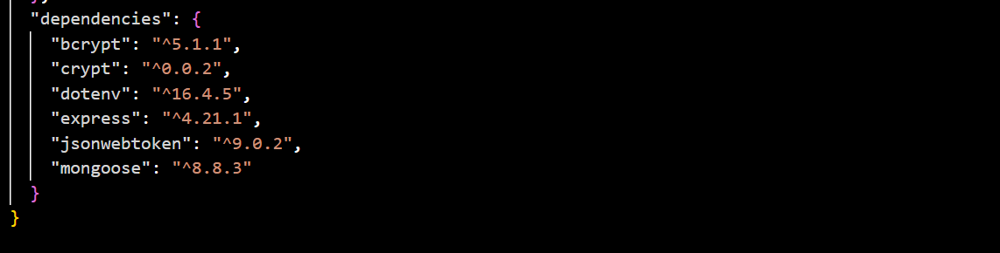

the blogger project consists of various properties like the create post, get all posts, delete post, update post... now this was a very simple and function implementation of CRUD(create, read, update and delete).
this readme would also guide you on how to download and implement the code to your own personal project. 
firsty, you would need to run "npm i or npm install" to install all the dependencies
